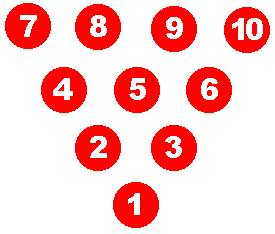
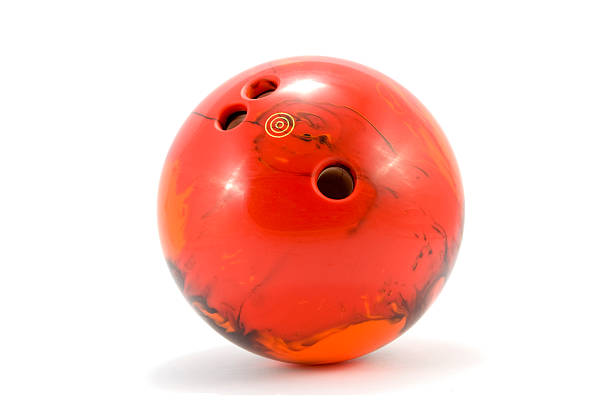
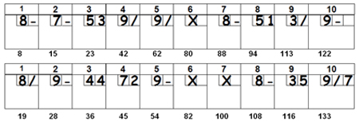
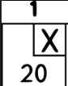
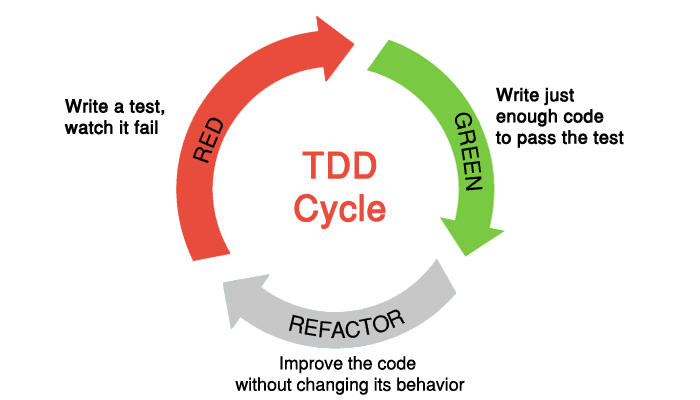

# KataBowling

This kata is related to the one my teacher did on Java ([dfleta-bowling-java](https://github.com/dfleta/bowling-game-kata)) and the one Emily Blache did in her book ([Emily-Bowling-github](https://github.com/emilybache)). It is created in the language java so i will adapt it to python.

The book of Emily: [The Coding Dojo Handbook, a practical guide to creating a space where good programmers can become great programmers](https://leanpub.com/codingdojohandbook)

First an introduction to the bowling rules and how this game works.

## Pins

The pin has to be place like the following image:



## Ball

The ball has to be maximum 7 kg and the player has to select the one he thinks is the most confortable with.



## Turn

Each player has 10 turns in which can throw the ball two times in case their do not get all the pins. In case their get a strike (first throw getting 10 pins) the player just throw it once

## Score

It is kinda confusing to understand how a bowling match works. I will let you a game example so it is easier to get it.



Here we can see a game in which two players have thrown the ball in 10 turns.

The notation of the score is the following:

* The score card has 10 cells called frames with 2 parts each one and the total score acumulated



* We annotate numbers of pins we got in one throw at the left cell (1.) Each pin count as one. After we throw again, we annotate the rest pin gotten at the second cell (2.).

* We annotate a "X" if we made an strike: all pins got at one throw. The score given in 10 plus the pins gotten at the next two throws.

* We annotate a "/" if we made a spare: got all the pins but in two throws. The score given in 10 plus the pins gotten at the next throw.

* We annotate a "-" if we did not get any pin after we already threw the ball

* We annotate a "0" if the player have commited an error: passing the line, not taking a single pin, etc...

* At the last frame, the player can throw maximum three balls in case their makes consecutives strikes.

## Kata

Now that we know a little about the game and rules, I will introduce what am i going to do in this kata. I will follow the Test Driven Development so the workflow will be the next one: test-code-(passes)-refactor



First, I will make simple users story in which it will introduce the functionalities about this program. Since this kata is already done by my teacher, the goal is to start writing code to pass the test he wrote in java but translate it to python:

```java
TotalScoreHittingPinsTest() {

       # Hitting pins total = 60
       pins = "12345123451234512345";
       int total = 60;
       scoreCard = ScoreCard(pins);
       scoreCard.calculateScore();
       assertEquals(total, scoreCard.getTotalScore());
   }

TotalScoreHittingPinsFailTest() {

       // test symbol -

       pins = "9-9-9-9-9-9-9-9-9-9-";
       total = 90;
       scoreCard = ScoreCard(pins);
       scoreCard.calculateScore();
       assertEquals(total, scoreCard.getTotalScore());

       pins = "9-3561368153258-7181";
       total = 82;
       scoreCard = ScoreCard(pins);
       scoreCard.calculateScore();
       assertEquals(total, scoreCard.getTotalScore());
    }
```

Then when we have the test translated i will start writing code and refactoring till the goal is completed.

```python

```